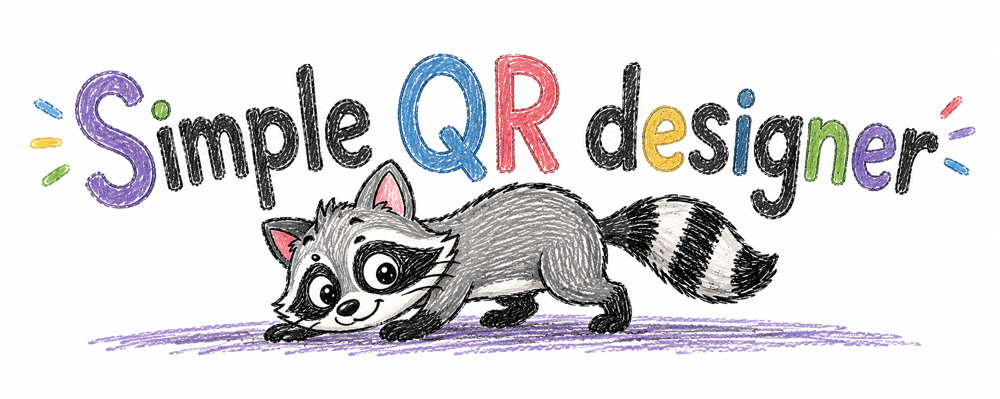

<p align="center">
  
</p>

# Simple QR Designer

Generador de códigos QR personalizable para escritorio. Prioridad: **rápido y liviano**. Crea QR en SVG, PNG o WEBP, con estilos, colores, marcos y logotipo, sin depender de un servicio en la nube.

| | |
| -------- | -------------------------------------------------------------------------------------------------------------------------------------------------------------------------------------------------- |
| Paquete | [](https://github.com/RicardoNajeraG/simple-qr-designer/releases) [](https://www.python.org/downloads/) [](https://github.com/RicardoNajeraG/simple-qr-designer/releases) |
| Build | [](https://github.com/RicardoNajeraG/simple-qr-designer/actions/workflows/release.yml) |
| Meta | [](https://github.com/RicardoNajeraG/simple-qr-designer/blob/master/LICENSE) [](https://github.com/RicardoNajeraG/simple-qr-designer/commits/master) [](https://github.com/RicardoNajeraG/simple-qr-designer) |

## ¿Qué es Simple QR Designer?

**Simple QR Designer** es una aplicación de escritorio y una herramienta de línea de comandos, escritas en Python, para **diseñar y exportar códigos QR** a partir de una URL o de texto plano.

A diferencia de los generadores QR en el navegador, el trabajo ocurre **en el equipo local**: la edición vive en una escena vectorial en memoria y Pillow solo se carga al previsualizar o exportar PNG/WEBP. El resultado se puede guardar como **SVG** (vector), **PNG** o **WEBP**.

Sirve para marcas, menús, empaques, carteles, documentación y cualquier caso en el que el QR tenga que coincidir con una identidad visual y seguir siendo escaneable.

## Tabla de contenido

- [Características](#características)
- [Instalación](#instalación)
- [Uso](#uso)
- [Perfiles](#perfiles)
- [Preguntas frecuentes](#preguntas-frecuentes)
- [Documentación para desarrollo](#documentación-para-desarrollo)
- [Licencia](#licencia)
- [Código de conducta](#código-de-conducta)
- [Autor](#autor)

## Características

- **Escritorio y CLI** en Windows, Linux y macOS, con interfaz en español.
- **Exportación** a SVG, PNG y WEBP desde un solo flujo: pegar contenido → personalizar → exportar.
- **Presets de fábrica:** Clásico, Redondeado, Puntos, Escanéame y Barras.
- **Estilos de módulo** (cuadrado, redondeado, puntos, gota, barras, squircle) y **ojos** (cuadrado, redondeado, círculo, hoja, squircle).
- **Marcos** opcionales: perímetro, banda o «Escanéame» con texto.
- **Colores** con selector propio (rueda + RGBA); el perfil guarda RGB opaco.
- **Logotipo centrado** (PNG, JPEG, WEBP, GIF o SVG), guardado como ruta en el perfil de usuario.
- **Perfiles de usuario** aparte de los presets de solo lectura. El perfil no incluye la URL.
- **Vista previa en vivo** con el mismo raster que el export (píxeles enteros por módulo).
- **Parámetros técnicos** (corrección de errores, píxeles por módulo) en **Avanzado**, colapsado por defecto.
- **Dependencia de runtime:** [`segno`](https://pypi.org/project/segno/). GUI con **tkinter** (stdlib). Pillow es extra opcional para PNG/WEBP.

## Instalación

### Instaladores (recomendado)

Descarga la última versión en [GitHub Releases](https://github.com/RicardoNajeraG/simple-qr-designer/releases):

- **Windows:** ejecuta el `.exe`.
- **Debian/Ubuntu:** `sudo apt install ./qr-designer-*-linux-*.deb`
- **macOS:** abre el `.dmg`. Si Gatekeeper bloquea: clic derecho → Abrir. El binario no está notarizado.

Requisito si compilas o ejecutas desde el código: **Python ≥ 3.11**.

### Desde el código fuente

```bash
uv sync
# PNG / WEBP y la misma calidad de vista previa:
uv sync --extra raster

uv run qr-designer
```

## Uso

### Interfaz gráfica

Flujo: pegar URL o texto (también con el ratón) → el QR con el perfil **Clásico** ya está listo → elige formato (SVG/PNG/WEBP) → **Exportar imagen**.

- Personalizar actualiza en vivo.
- El divisor entre opciones y preview se arrastra para agrandar el panel de opciones.
- Clic en el swatch o el hex de un color abre el selector.
- **Guardar perfil** pide un nombre si el activo es de fábrica (crea un perfil de usuario) y confirma antes de sobrescribir uno de Mis perfiles.

### Línea de comandos

```bash
uv run qr-designer --url "https://example.com" -o qr.svg
uv run qr-designer --url "https://example.com" --preset Puntos -o qr.png --px 8
uv run qr-designer --url "https://example.com" --logo marca.png -o qr.svg
```

También acepta `--text` como alias de `--url` (sirve para texto plano, no solo direcciones web). Formatos: `svg`, `png`, `webp`.

## Perfiles

Los 5 presets de fábrica son de solo lectura. Los perfiles de usuario viven en:

- **Linux:** `~/.qr_designer/profiles.json`
- **macOS:** `~/Library/Application Support/QR Designer/profiles.json`
- **Windows:** `%APPDATA%/QR Designer/profiles.json`

Si ya existía el archivo legado `~/.qr_designer/profiles.json` y aún no hay canónico, se copia una vez; el legado no se borra.

## Preguntas frecuentes

**¿Simple QR Designer es una app web?**  
No. Es software de escritorio (tkinter) y una CLI. No hace falta cuenta ni conexión para diseñar, salvo que el contenido del QR sea una URL que quieras probar después en el teléfono.

**¿Qué formatos de imagen genera?**  
SVG vectorial, PNG y WEBP. PNG y WEBP necesitan el extra `raster` (Pillow) si ejecutas desde el código; los instaladores de Releases ya lo incluyen.

**¿Puedo poner un logotipo en el centro?**  
Sí. Acepta PNG, JPEG, WEBP, GIF o SVG. Conviene usar corrección de errores alta (el preset Puntos ya trae ECC H) para que el código siga siendo escaneable.

**¿El perfil guarda la URL?**  
No. Guarda estilo, colores, marco y la ruta del logotipo. El contenido se pega o se pasa por `--url` / `--text` en cada uso.

**¿Funciona sin Python instalado?**  
Sí, si usas el `.exe`, el `.deb` o el `.dmg` de [Releases](https://github.com/RicardoNajeraG/simple-qr-designer/releases). Desde el repositorio hace falta Python ≥ 3.11 y `uv`.

**¿Dónde está la documentación técnica?**  
En [`READMEdevs.md`](READMEdevs.md): arquitectura, tests, empaquetado y criterios de aceptación.

## Documentación para desarrollo

Arquitectura, tests, publicación de versiones y checklist de escaneo: **[`READMEdevs.md`](READMEdevs.md)**.

## Licencia

[MIT](LICENSE)

## Código de conducta

La participación en este proyecto se rige por el [Código de Conducta](CODE_OF_CONDUCT.md). Al abrir un issue, enviar un pull request o comentar, se espera que lo respetes. Los reportes se reciben en [ricardonajera93@gmail.com](mailto:ricardonajera93@gmail.com).

## Autor

**Ricardo Nájera**  
📧 [ricardonajera93@gmail.com](mailto:ricardonajera93@gmail.com)  
📦 [github.com/RicardoNajeraG/simple-qr-designer](https://github.com/RicardoNajeraG/simple-qr-designer)
